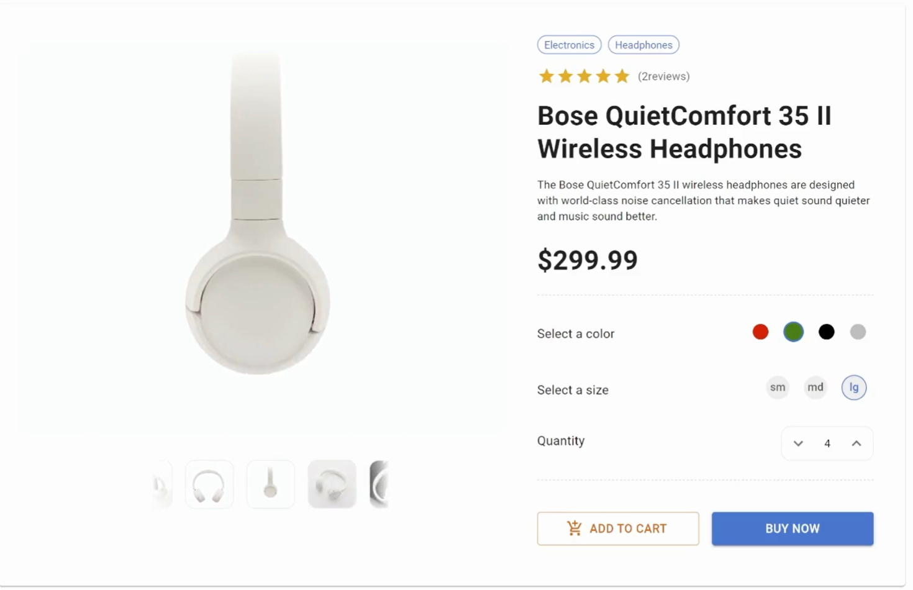
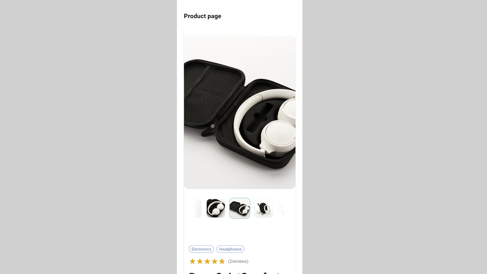

#  Building a Product Page Component with React TypeScript and MUI

Here are some key features of the component:

- Responsive design that adapts to different screen sizes and devices
- Product image gallery using slick-carousel
- Product details section with pricing, description, and customizable options (such as color and size)

